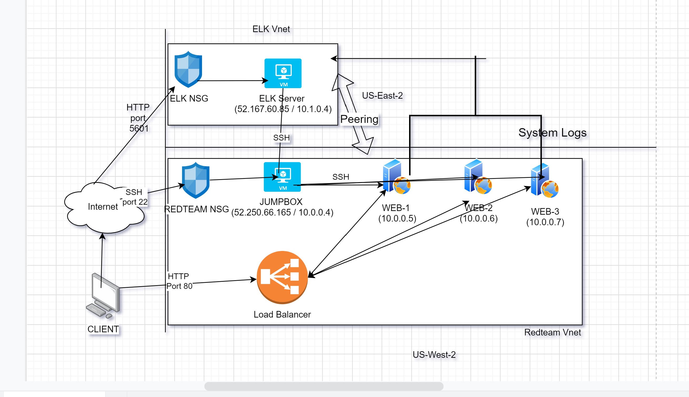
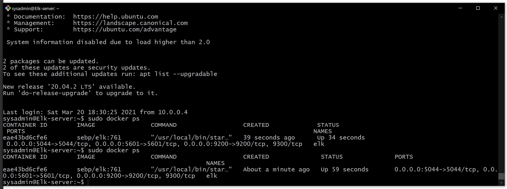

## Automated ELK Stack Deployment

The files in this repository were used to configure the network depicted below.

These files have been tested and used to generate a live ELK deployment on Azure. They can be used to either recreate the entire deployment pictured above. Alternatively, select portions of the ansible playbook file may be used to install only certain pieces of it, such as Filebeat.

  - webserver-playbook.yaml
  - elk-playbook.yaml
  - filebeat_playbook.yaml
  - metricbeat_playbook.yaml

This document contains the following details:
- Description of the Topologu
- Access Policies
- ELK Configuration
  - Beats in Use
  - Machines Being Monitored
- How to Use the Ansible Build

### Description of the Topology

The main purpose of this network is to expose a load-balanced and monitored instance of DVWA, the D*mn Vulnerable Web Application.

Load balancing ensures that the application will be highly available, in addition to restricting ssh access to the network.
- Load balancers ensure that web clients access the files hosted on web server through load balancer instead of directly accessing server VM.
- Load balancers can implement security measures like mandating HTTPS, establishing session with web client. Clients cannot manipulate files on the web server as they do not have direct access. Load balancers can restrict access to certain set of clients.
- Load balancers distribute the traffic among web servers as per set rules, thus ensuring high availability.
- Jumpboxes are used to configure the web servers through ssh access.

Integrating an ELK server allows users to easily monitor the vulnerable VMs for changes to the logs and system processes.
- Filebeat sends syslogs collected from system services such as auth logs to the elk server which helps monitor suspicious activity
- Metricbeat sends information about system processes such as CPU, Memory and Network activity to ELK which helps monitor
  system health

The configuration details of each machine may be found below.
_Note: Use the [Markdown Table Generator](http://www.tablesgenerator.com/markdown_tables) to add/remove values from the table_.

| Name       | Function        | IP Address               | Operation System |
|------------|-----------------|--------------------------|------------------|
| Jump Box   | Gateway         | 10.0.0.4 / 52.250.66.165 | Linux            |
| Web-1      | Web server DVWA | 10.0.0.5                 | Linux            |
| Web-2      | web server DVWA | 10.0.0.6                 | Linux            |
| Web-3      | Web server DVWA | 10.0.0.7                 | Linux            |
| Elk server | ELK server      | 10.1.0.4 / 52.167.60.85  | Linux            |
| LB         | Load Balancer   | 52.143.120.66            |                  |

### Access Policies

The machines on the internal network are not exposed to the public Internet. 

Only the Jumpbox machine can accept connections from the Internet. Access to this machine is only allowed from the following IP addresses:
- Ipv4 address of client machine

Machines within the network can only be accessed by Jumpbox.
- 10.0.0.4

A summary of the access policies in place can be found in the table below.

| Name              | Publicly Accessible | Allowed ip addresses                        |
|-------------------|---------------------|---------------------------------------------|
| Jumpbox           | Yes, SSH port 22    | Client IP, VPN 10.0.0.0/24, VPN 10.1.0.0/24 |
| Load Balancer     | Yes, HTTP Port 80   | Client IP, VPN (10.0.0.0/24)                |
| ELK server        | Yes, HTTP Port 5601 | Client IP, VPN 10.0.0.0/24, VPN 10.1.0.0/24 |
| Web Servers 1,2,3 | No                  | Virtual Network (10.0.0.0/24)               |
|                   |                     |                                             |

### Elk Configuration

Ansible was used to automate configuration of the ELK machine. No configuration was performed manually, which is advantageous because...
- You can repeat this process across several machines in minimum time
- The process is more uniform

The playbook implements the following tasks:
- Increase vm max map count to 262144
- Install docker, python-pip3 using apt
- Download and start sebp/elk docker container
- Configure docker service to always start on restart of the VM

The following screenshot displays the result of running `docker ps` after successfully configuring the ELK instance.

### Target Machines & Beats
This ELK server is configured to monitor the following machines:
- 10.0.0.5
- 10.0.0.6
- 10.0.0.7

We have installed the following Beats on these machines:
- Filebeat, Metricbeat

These Beats allow us to collect the following information from each machine:
- Filebeat sends syslogs collected from system services such as auth logs to the elk server which helps monitor suspicious activity
- Metricbeat sends information about system processes such as CPU, Memory and Network activity to ELK which helps monitor
  system health

### Using the Playbook
In order to use the playbook, you will need to have an Ansible control node already configured. Assuming you have such a control node provisioned: 

SSH into the control node and follow the steps below:
- Copy the elk-playbook.yaml file to /etc/ansible/roles.
- Update the hosts file to include ip of elk server under category [elk]
- Run the playbook, and navigate to http://[public ip]/app/kibana#/home to check that the installation worked as expected.
